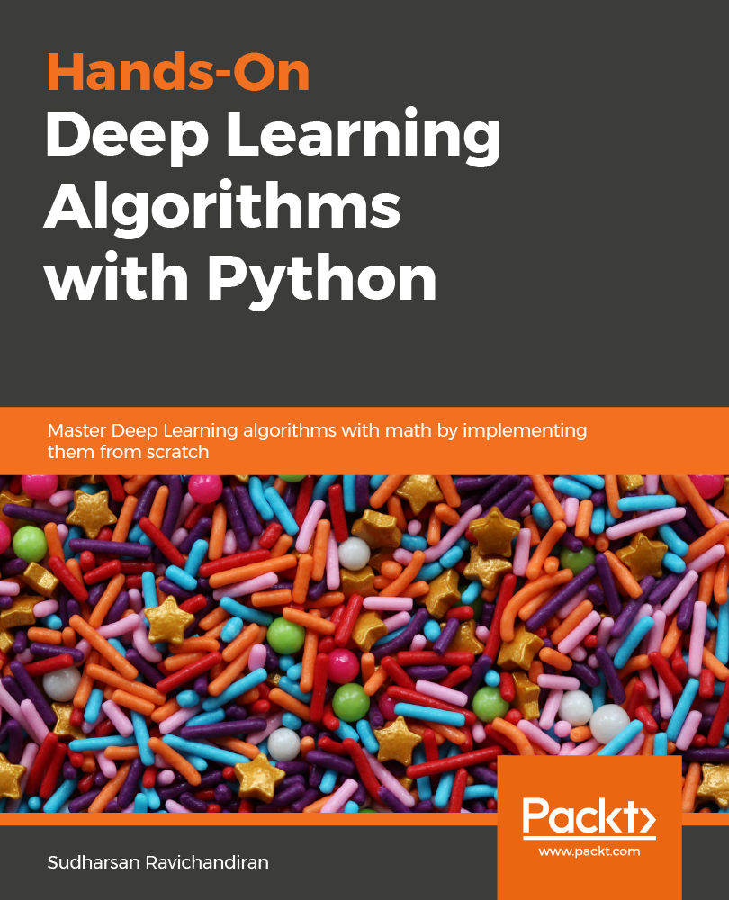

# Hands-On Deep Learning Algorithms with Python

<a href="https://www.packtpub.com/big-data-and-business-intelligence/hands-deep-learning-algorithms-python?utm_source=github&utm_medium=repository&utm_term=9781789344158"></a>

This is the code repository for [Hands-On Deep Learning Algorithms with Python](https://www.packtpub.com/big-data-and-business-intelligence/hands-deep-learning-algorithms-python?utm_source=github&utm_medium=repository&utm_term=9781789344158), published by Packt.

**Master deep learning algorithms with extensive math by implementing them using TensorFlow**

## What is this book about?
Deep learning is one of the most popular domains in the AI space, allowing you to develop multi-layered models of varying complexities.

This book covers the following exciting features:
* Implement basic-to-advanced deep learning algorithms
* Master the mathematics behind deep learning algorithms
* Become familiar with gradient descent and its variants, such as AMSGrad, AdaDelta, Adam, and Nadam
* Implement recurrent networks, such as RNN, LSTM, GRU, and seq2seq models
* Understand how machines interpret images using CNN and capsule networks

If you feel this book is for you, get your [copy](https://www.amazon.com/dp/1789344158) today!

<a href="https://www.packtpub.com/?utm_source=github&utm_medium=banner&utm_campaign=GitHubBanner"></a>

## Instructions and Navigations
All of the code is organized into folders.

The code will look like the following:
```
J_plus = forward_prop(x, weights_plus)
J_minus = forward_prop(x, weights_minus)
```

**Following is what you need for this book:**
If you are a machine learning engineer, data scientist, AI developer, or simply want to focus on neural networks and deep learning, this book is for you. Those who are completely new to deep learning, but have some experience in machine learning and Python programming, will also find the book very helpful.

With the following software and hardware list you can run all code files present in the book (Chapter 1-10).

### Software and Hardware List

| Chapter  | Software required                              | OS required                        |
| -------- | -----------------------------------------------| -----------------------------------|
| 1-10     | Python 2.7, TensorFlow 1.13.1                  | Linux (Any)                        |
| 2        | Python 2.7, TensorFlow 1.13.1, TensorFlow 2.0  | Linux (Any)                        |


We also provide a PDF file that has color images of the screenshots/diagrams used in this book. [Click here to download it](http://www.packtpub.com/sites/default/files/downloads/9781789344158_ColorImages.pdf).


### Related products <Other books you may enjoy>
* Deep Learning with PyTorch [[Packt]](https://www.packtpub.com/big-data-and-business-intelligence/deep-learning-pytorch?utm_source=github&utm_medium=repository&utm_term=9781788624336) [[Amazon]](https://www.amazon.com/dp/1788624335)

* Python Deep Learning [[Packt]](https://www.packtpub.com/big-data-and-business-intelligence/python-deep-learning?utm_source=github&utm_medium=repository&utm_term=9781786464453) [[Amazon]](https://www.amazon.com/dp/1786464454)

## Get to Know the Author
[**Sudharsan Ravichandiran**](https://www.linkedin.com/in/sudharsan1396/)
is a data scientist, researcher, artificial intelligence enthusiast, and YouTuber (search for Sudharsan reinforcement learning). He completed his bachelor's in information technology at Anna University. His area of research focuses on practical implementations of deep learning and reinforcement learning, which includes natural language processing and computer vision. He is an open source contributor and loves answering questions on Stack Overflow. He also authored a best-seller, Hands-On Reinforcement Learning with Python, published by Packt Publishing.

## Other books by the authors
* [Deep Reinforcement Learning with Python](https://www.amazon.com/gp/product/B08HSHV72N/ref=dbs_a_def_rwt_bibl_vppi_i4)
* [Hands-On Reinforcement Learning with Python](https://www.packtpub.com/big-data-and-business-intelligence/hands-reinforcement-learning-python?utm_source=github&utm_medium=repository&utm_term=9781788836524)
* [Hands-On Meta Learning with Python](https://www.packtpub.com/big-data-and-business-intelligence/hands-meta-learning-python?utm_source=github&utm_medium=repository&utm_term=9781789534207)
* [Python Reinforcement Learning](https://www.packtpub.com/big-data-and-business-intelligence/python-reinforcement-learning?utm_source=github&utm_medium=repository&utm_term=9781838649777)

### Suggestions and Feedback
[Click here](https://docs.google.com/forms/d/e/1FAIpQLSdy7dATC6QmEL81FIUuymZ0Wy9vH1jHkvpY57OiMeKGqib_Ow/viewform) if you have any feedback or suggestions.
